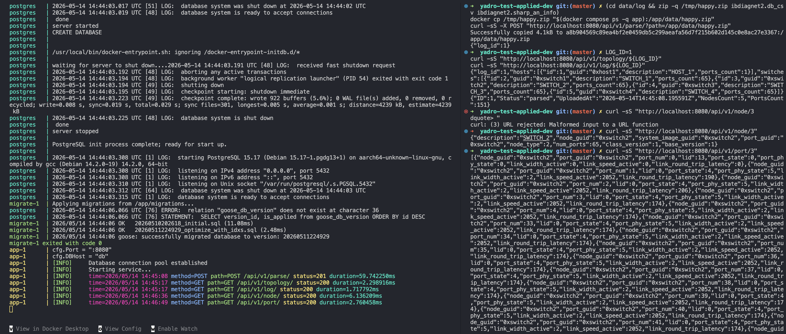
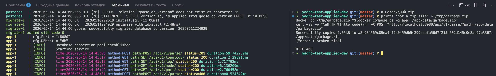
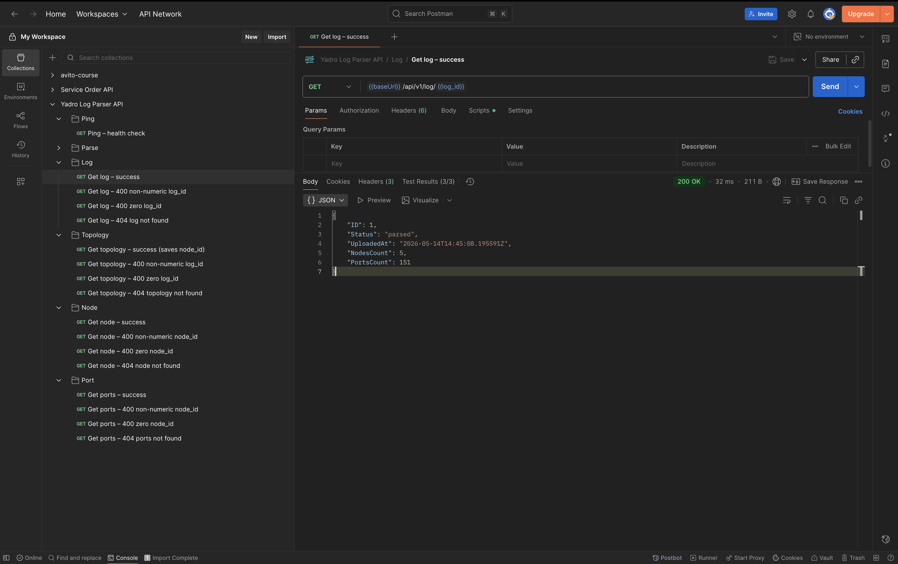

# yadro-test-applied-dev

HTTP-сервис для разбора логов InfiniBand (архив ZIP с файлами `ibdiagnet2.db_csv` и `ibdiagnet2.sharp_an_info`) и выдачи метаданных, топологии и данных по узлам.

## Требования

- Go 1.25.3 или новее (см. `go.mod`)
- Docker и Docker Compose (для варианта с контейнерами)
- PostgreSQL 15 (для локального запуска без Docker)

## Переменные окружения

Скопируйте пример и заполните значения:

```sh
cp .env.example .env
```

Основные переменные: `PORT`, `POSTGRES_HOST`, `POSTGRES_PORT`, `POSTGRES_USER`, `POSTGRES_PASSWORD`, `POSTGRES_DB`, `POSTGRES_SSLMODE`, `LOG_LEVEL`.

В `docker-compose.yaml` порт приложения на хосте задаётся как `${PORT}:8080`, а процесс внутри контейнера слушает тот же `PORT` из окружения. Чтобы маппинг совпадал с портом процесса, задайте в `.env`, например, `PORT=8080` (тогда сервис будет доступен на `http://localhost:8080`).

## Запуск через Docker Compose

Из корня репозитория:

```sh
docker compose up --build
```

Поднимаются PostgreSQL, одноразовый job миграций (`migrate`) и приложение (`app`). Остановка: `Ctrl+C` или `docker compose down`.

Образ приложения собирает бинарник командой `go build -o /service ./cmd/service` (см. `Dockerfile`, stage `builder`, target `app`).

## Тесты

```sh
go test ./...
```

> Покрытие юнит тестами всего проекта - 18.0%

## API и примеры `curl`

Базовый URL ниже — `http://localhost:8080`; подставьте свой хост и порт.

### Пинг

```sh
curl -sS "http://localhost:8080/api/v1/ping"
```

Ожидаемый ответ: JSON с полем `"message":"pong"`.

### Happy path: разбор архива

Архив должен быть доступен **на файловой системе процесса** сервиса (в Docker это файлы внутри контейнера). В образ копируется каталог `data/` в `/app/data/` (см. `Dockerfile`).

Соберите ZIP из примеров файлов в репозитории и скопируйте его в контейнер приложения:

```sh
(cd data/log && zip -q /tmp/happy.zip ibdiagnet2.db_csv ibdiagnet2.sharp_an_info)
docker cp /tmp/happy.zip "$(docker compose ps -q app):/app/data/happy.zip"
curl -sS -X POST "http://localhost:8080/api/v1/parse/?path=/app/data/happy.zip"
```

Успешный ответ: HTTP 201 и JSON с полем `log_id` (число). Дальше можно запросить, например:

```sh
LOG_ID=1
curl -sS "http://localhost:8080/api/v1/topology/${LOG_ID}"
curl -sS "http://localhost:8080/api/v1/log/${LOG_ID}"
```

Подставьте реальный `log_id` из ответа `parse`.

### Ошибка: невалидный ZIP (`POST /api/v1/parse/`)

```sh
printf 'not a zip file' > /tmp/garbage.zip
docker cp /tmp/garbage.zip "$(docker compose ps -q app):/app/data/garbage.zip"
curl -sS -w "\nHTTP %{http_code}\n" -X POST "http://localhost:8080/api/v1/parse/?path=/app/data/garbage.zip"
```

Ожидается HTTP 400 и тело вида `{"error":"broken zip"}`.

### Ошибка: отсутствует query-параметр `path`

```sh
curl -sS -w "\nHTTP %{http_code}\n" -X POST "http://localhost:8080/api/v1/parse/"
```

Ожидается HTTP 400 и `{"error":"path is required"}`.

### Ошибка: неверный идентификатор в пути (другой эндпоинт)

```sh
curl -sS -w "\nHTTP %{http_code}\n" "http://localhost:8080/api/v1/log/not-a-number"
```

Ожидается HTTP 400 и `{"error":"log_id is required"}`.

### Ошибка: запись не найдена

```sh
curl -sS -w "\nHTTP %{http_code}\n" "http://localhost:8080/api/v1/log/999999999"
```

Ожидается HTTP 404 и `{"error":"log not found"}` (если такого `log_id` нет в базе).

## Маршруты

| Метод | Путь | Назначение |
|--------|------|------------|
| GET | `/api/v1/ping` | Проверка сервиса |
| POST | `/api/v1/parse/?path=...` | Разбор ZIP по пути на диске |
| GET | `/api/v1/topology/{log_id}` | Топология по логу |
| GET | `/api/v1/log/{log_id}` | Метаданные лога |
| GET | `/api/v1/node/{node_id}` | Узел |
| GET | `/api/v1/port/{node_id}` | Порты узла |

## Топология и «граф» из узлов и портов

В текущей реализации построение графа реализовано частично. Эндпоинт `GET /api/v1/topology/{log_id}` — не граф с рёбрами, а каталог узлов по логу: два списка `hosts` и `switches`, у каждой записи есть `id`, `guid`, `description`, `ports_count`. Связи между узлами и сами порты в этом ответе **включаются. Связь «узел владеет портами» есть в данных: порты сохраняются с привязкой к узлу и отдаются `GET /api/v1/port/{node_id}` (по внутреннему `id` узла в БД).

То есть явного построения графа смежности (вершины = узлы, рёбра = линки между узлами) в коде нет.

Ориентир для доработки: принадлежность порта узлу уже заложена в модели (`ports.node_id`, `Port.NodeGUID`) и в эндпоинте `GET /api/v1/port/{node_id}`. Чтобы из лога восстановить, какие **узлы** соединены друг с другом в фабрике, одного текущего набора полей обычно недостаточно: в CSV есть LID порта, а для явных рёбер графа смежности нужны дополнительные сведения из ibdiagnet (например remote LID / peer из других секций) или отдельная сущность в БД. Разделение на host и switch сейчас задаётся только полем `node_type` в ответе `/topology`; более конкретную картину (например leaf/spine) имело бы смысл строить поверх слоя смежности между узлами, когда он появится.

Итого: сервис **хранит и отдаёт** узлы и порты с явной связью узел–порт; топология в смысле графа сети (кто с кем соединён) не вычисляется и в JSON топологии не отражается.

## Запуск форматтера и линтера 

```bash
make fmt
make lint
```

## Демонстрация работы сервиса 

> Запуск приложения через `docker compose up --build` (с прогоном миграций)


> Получение статус кода 400 при отправке невалидного .zip 


> Коллекция Postman

